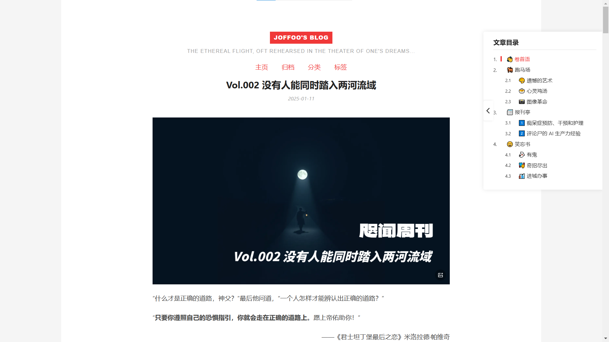

# Hexo Theme Hacker

> 本主题基于 [CodeDaraW/Hacker](https://github.com/CodeDaraW/Hacker) 进行开发

[English Version](README_EN.md)

一个简洁、优雅的 Hexo 主题，专注于写作与阅读体验。示例网站：[fengyukongzhou.github.io](https://fengyukongzhou.github.io)



## 特性

- 🎨 简约设计，突出内容
- 📱 响应式布局，支持移动端深色模式
- 💡 代码高亮支持
- 📑 文章目录支持
- ❤️ 文章点赞功能
- 💬 多评论系统支持
- 📊 Google Analytics 和百度统计支持
- 📝 MathJax 数学公式支持

## 快速开始

### 安装

```bash
git clone https://github.com/fengyukongzhou/Hacker.git themes/hacker
```

### 配置

1. 修改 Hexo 根目录下的 `_config.yml`：
```yaml
theme: hacker
```

2. 参考示例配置文件 `_config.example.yml`，创建并编辑主题配置文件 `_config.yml`：
```bash
cp themes/hacker/_config.example.yml themes/hacker/_config.yml
```

3. 根据需要修改主题配置文件 `themes/hacker/_config.yml`

### 更新主题

```bash
cd themes/hacker
git pull
```

## 配置说明

### 基础配置

```yaml
menu:
  Home: /
  Archives: /archives
  Categories: /categories
  Tags: /tags

# 是否显示阅读更多按钮
read_more_btn: false

# 数学公式支持
mathjax:
  enable: true
  cdn: https://cdn.jsdelivr.net/npm/mathjax@2.7.8/MathJax.js?config=TeX-AMS-MML_HTMLorMML

# 目录配置
toc:
  enable: true
  number: true
```

### 评论系统

支持多种评论系统：
- Gitalk
- Gitment
- Valine
- Disqus
- Utterances
- Livere
- Giscus

### 统计分析

支持 Google Analytics 和百度统计，在配置文件中填入对应的跟踪 ID 即可。

### 点赞功能

基于 LeanCloud 实现的文章点赞功能，需要配置：
```yaml
like_button:
  enable: true
  appId: your-app-id
  appKey: your-app-key
  serverURL: your-server-url
```

## 贡献

欢迎提交 Issue 和 Pull Request。

## 许可证

[MIT License](LICENSE) 