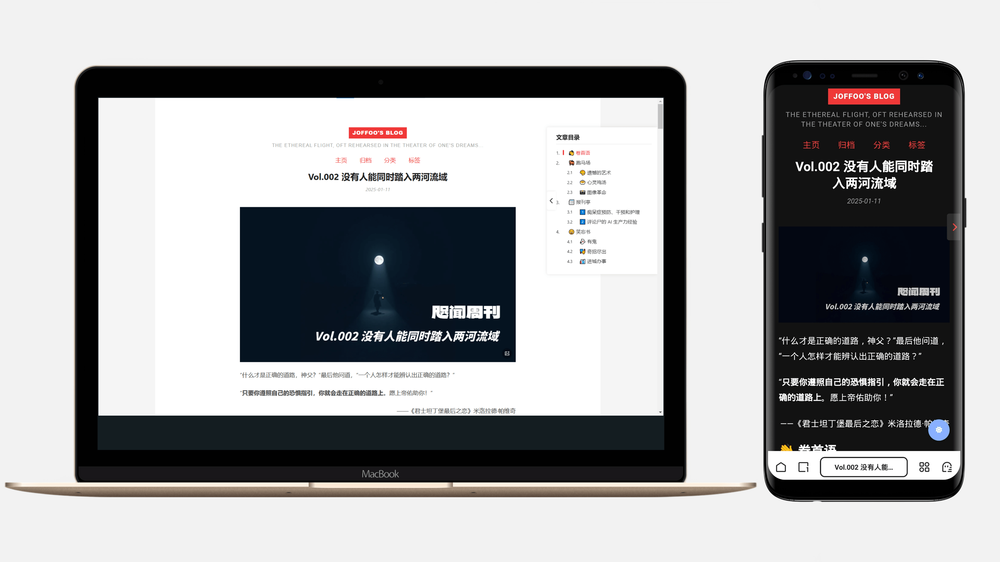

# Hexo Theme Hacker

> 本主题基于 [CodeDaraW/Hacker](https://github.com/CodeDaraW/Hacker) 进行开发

[English Version](README_EN.md)

一个简洁、优雅的 Hexo 主题，专注于写作与阅读体验。示例网站：[fengyukongzhou.github.io](https://fengyukongzhou.github.io)



## 特性

- 🎨 简约设计，突出内容
- 📱 响应式布局，支持深色模式
- 💡 代码高亮支持
- 📑 文章目录支持
- ❤️ 文章点赞功能
- 💬 多评论系统支持
- 📊 Google Analytics 和百度统计支持
- 📝 MathJax 数学公式支持
- 📈 集成 hexo-graph 数据可视化
- 🖋 优雅的中英文排版，中文斜体自动转换为楷体

## 快速开始

### 前置要求

安装必需的插件：
```bash
# 安装 hexo-graph 插件用于数据可视化
npm install hexo-graph

# 或使用 yarn
yarn add hexo-graph

# 或使用 pnpm
pnpm add hexo-graph
```

### 安装

```bash
git clone https://github.com/fengyukongzhou/Hacker.git themes/hacker
```

### 配置

1. 修改 Hexo 根目录下的 `_config.yml`：
```yaml
theme: hacker
```

2. 参考示例配置文件 `_config.example.yml`，创建并编辑主题配置文件 `_config.yml`：
```bash
cp themes/hacker/_config.example.yml themes/hacker/_config.yml
```

3. 根据需要修改主题配置文件 `themes/hacker/_config.yml`

### 更新主题

```bash
cd themes/hacker
git pull
```

## 配置说明

### 基础配置

#### 导航菜单
配置网站的导航菜单项，可以自定义添加需要的链接。

```yaml
menu:
  Home: /
  Archives: /archives
  Categories: /categories
  Tags: /tags
```

#### 网站图标
主题支持完整的网站图标配置，包括各种设备的图标支持。你可以使用 [favicon.io](https://favicon.io/favicon-converter/) 在线生成所需的图标文件。生成后，将所有文件放入 `source/favicon_io` 目录下。

支持的图标文件包括：
- android-chrome-192x192.png
- android-chrome-512x512.png
- apple-touch-icon.png
- favicon-16x16.png
- favicon-32x32.png
- favicon.ico
- site.webmanifest

配置示例：
```yaml
favicon:
  enable: true
  icon: /favicon_io/favicon.ico
  apple_touch_icon: /favicon_io/apple-touch-icon.png
  android_chrome_icon: /favicon_io/android-chrome-192x192.png
  manifest: /favicon_io/site.webmanifest
```

#### 阅读更多按钮
可以控制是否在文章列表中显示"阅读更多"按钮。

```yaml
read_more_btn: false
```

#### 数学公式支持
启用 MathJax 以支持数学公式的渲染。

```yaml
mathjax:
  enable: true
  cdn: https://cdn.jsdelivr.net/npm/mathjax@2.7.8/MathJax.js?config=TeX-AMS-MML_HTMLorMML
```

#### 文章目录
可以配置是否显示文章目录以及目录编号。

```yaml
toc:
  enable: true
  number: true
```

### 评论系统

支持多种评论系统：
- Gitalk
- Gitment
- Valine
- Disqus
- Utterances
- Livere
- Giscus

### 统计分析

支持 Google Analytics 和百度统计，在配置文件中填入对应的跟踪 ID 即可。

### 点赞功能

基于 LeanCloud 实现的文章点赞功能，需要配置：
```yaml
like_button:
  enable: true
  appId: your-app-id
  appKey: your-app-key
  serverURL: your-server-url
```

## 贡献

欢迎提交 Issue 和 Pull Request。

## 许可证

[MIT License](LICENSE)

## 使用说明

### 中英文斜体样式

本主题对中英文斜体采用了不同的处理方式：

1. 中文内容：使用楷体代替斜体（默认行为）
```markdown
*这是中文内容*  -> 将显示为楷体
```

2. 英文内容：需要特别指定语言以显示为斜体
```markdown
*<em lang="en">This is English content</em>*  -> 将显示为斜体
```

这样的设计是为了提供更好的中文阅读体验，因为中文字符倾斜往往会影响美观和可读性。 